# 아키텍처 다이어그램 (Architecture Diagrams)

Claude Code Remote 시스템의 전체 아키텍처를 시각적으로 설명하는 문서입니다.

## 목차

1. [시스템 전체 아키텍처](#1-시스템-전체-아키텍처)
2. [데이터 플로우](#2-데이터-플로우)
3. [컴포넌트 상세](#3-컴포넌트-상세)
4. [네트워크 아키텍처](#4-네트워크-아키텍처)
5. [보안 경계](#5-보안-경계)
6. [배포 아키텍처](#6-배포-아키텍처)

---

## 1. 시스템 전체 아키텍처

### 1.1 High-Level Overview

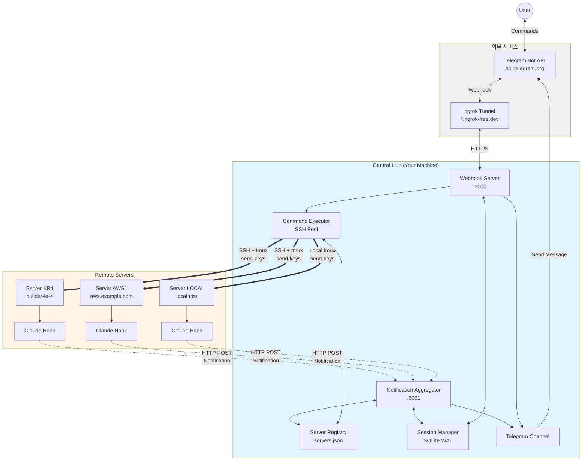

### 1.2 주요 컴포넌트

| 컴포넌트 | 역할 | 포트/프로토콜 |
|---------|------|--------------|
| **Telegram Bot API** | 사용자 인터페이스 (명령/알림) | HTTPS (443) |
| **ngrok Tunnel** | 공개 웹훅 URL 제공 | HTTPS → HTTP |
| **Notification Aggregator** | 원격 서버 알림 수신 | HTTP (3001) |
| **Webhook Server** | Telegram 명령 처리 | HTTP (3000) |
| **Server Registry** | 서버 목록 및 SSH 설정 | - |
| **Session Manager** | 세션 생명주기 관리 | SQLite WAL |
| **Command Executor** | SSH 연결 풀 및 명령 실행 | SSH (22) |
| **Telegram Channel** | Telegram API 통신 | HTTPS (443) |
| **Claude Hook** | Claude Code 이벤트 감지 | - |

---

## 2. 데이터 플로우

### 2.1 알림 플로우 (Remote Server → User)

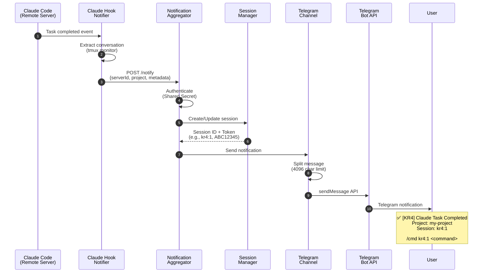

### 2.2 명령 플로우 (User → Remote Server)

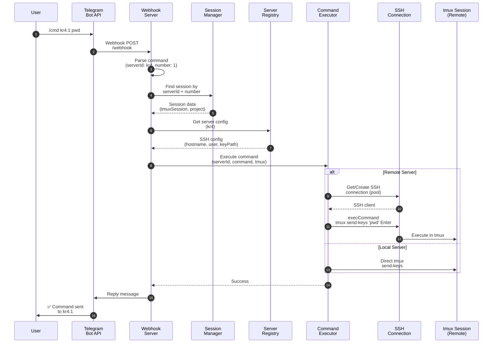

### 2.3 세션 생명주기

```mermaid
stateDiagram-v2
    [*] --> Created: Notification received

    Created --> Active: Session ID assigned<br/>(e.g., kr4:1)

    Active --> Active: Commands executed<br/>within 24h
    Active --> Expired: 24 hours elapsed
    Active --> Replaced: New session created<br/>(becomes kr4:2)

    Replaced --> Active: Renumbered<br/>(kr4:1 → kr4:2)

    Expired --> Deleted: Cleanup job
    Deleted --> [*]

    note right of Created: Token generated<br/>(e.g., ABC12345)

    note right of Active: Available for commands<br/>/cmd kr4:1 command

    note right of Expired: Session not usable<br/>Error: Session expired
```

---

## 3. 컴포넌트 상세

### 3.1 Central Hub 내부 구조

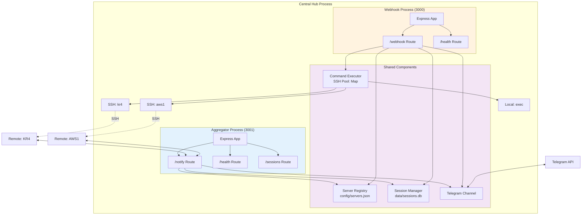

### 3.2 Session Manager (SQLite WAL)

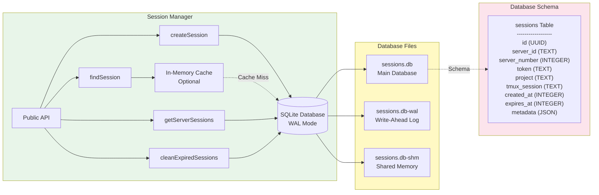

### 3.3 Command Executor (SSH Pool)

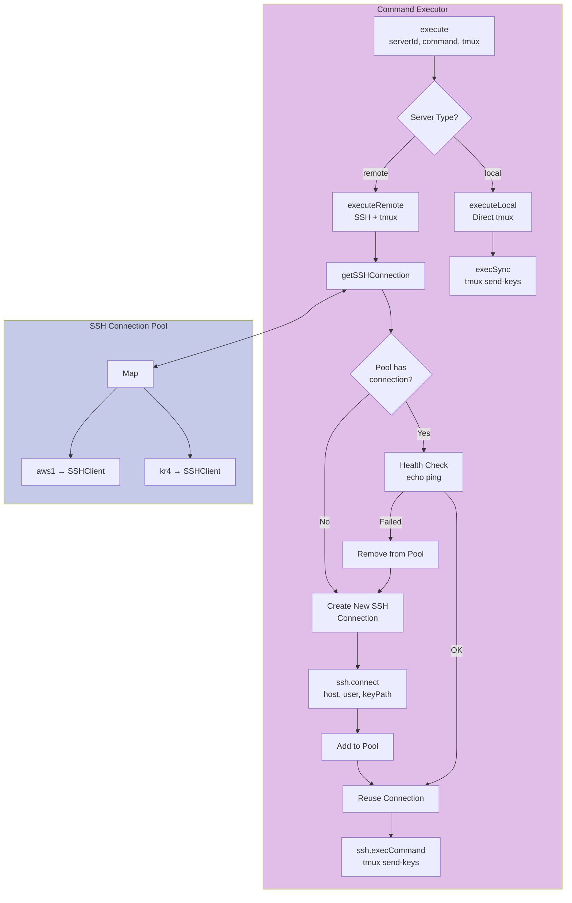

### 3.4 Server Registry

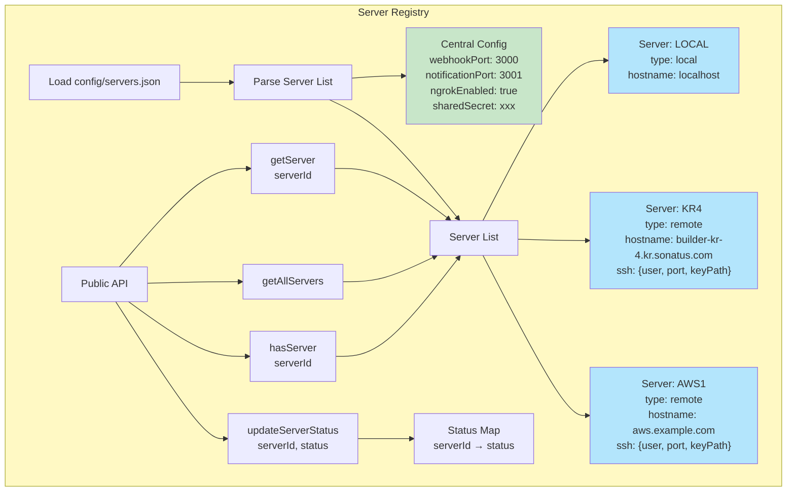

---

## 4. 네트워크 아키텍처

### 4.1 포트 및 프로토콜

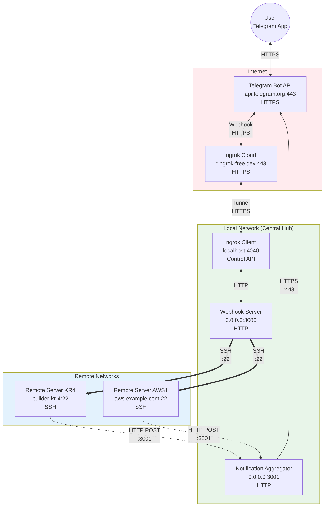

### 4.2 방화벽 규칙

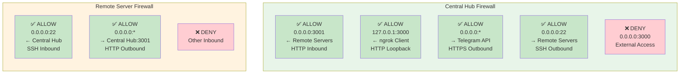

---

## 5. 보안 경계

### 5.1 인증 및 인가

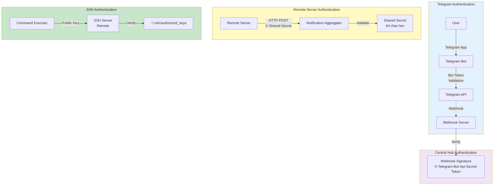

### 5.2 보안 계층

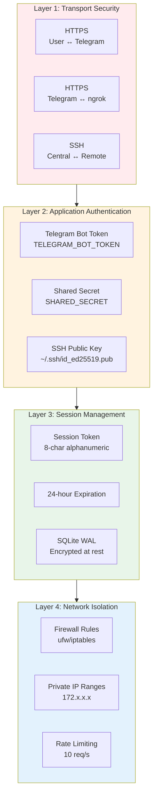

---

## 6. 배포 아키텍처

### 6.1 단일 Central Hub + 다중 Remote Servers

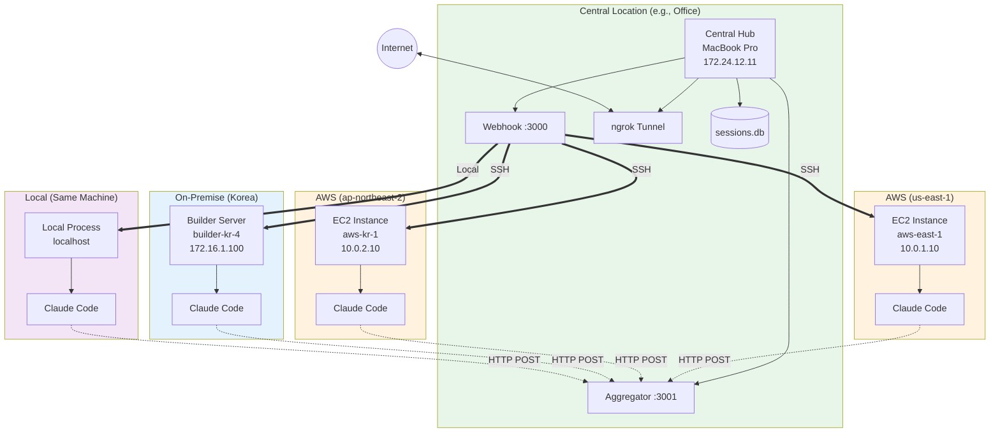

### 6.2 확장 시나리오 (다중 Central Hub)

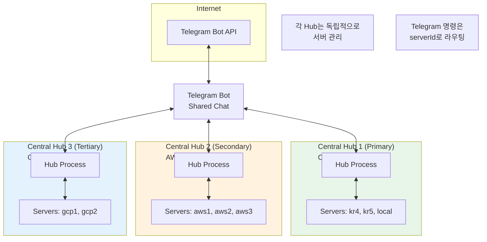

### 6.3 HA (High Availability) 구성

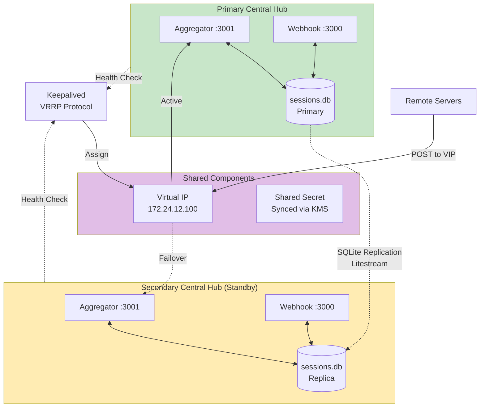

---

## 7. 기술 스택

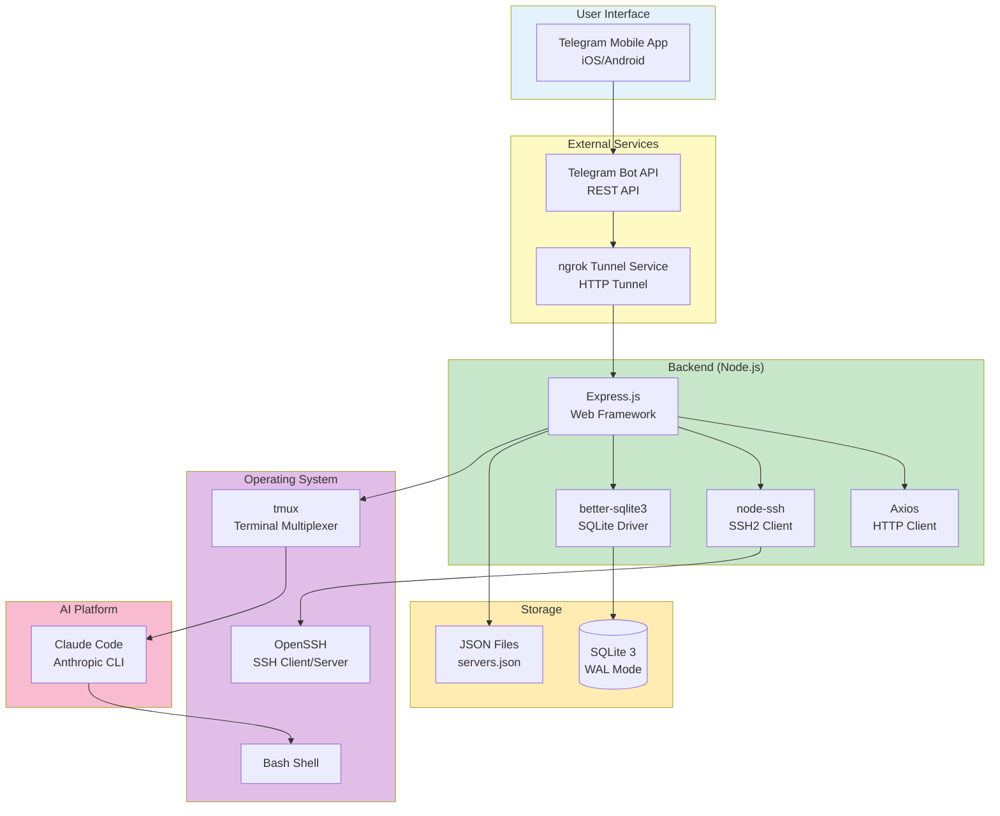

---

## 8. 성능 및 확장성

### 8.1 처리량 (Throughput)

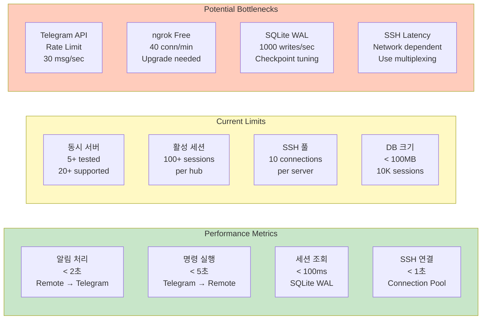

### 8.2 확장 전략

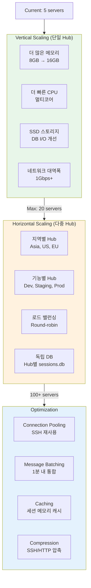

---

## 부록: Mermaid 다이어그램 렌더링

### GitHub에서 보기
이 문서의 Mermaid 다이어그램은 GitHub에서 자동으로 렌더링됩니다.

### 로컬에서 보기
- **VS Code**: Mermaid Preview Extension 설치
- **IntelliJ/WebStorm**: 기본 지원 (Markdown 미리보기)
- **CLI**: `mmdc` (mermaid-cli) 사용

```bash
# mermaid-cli 설치
npm install -g @mermaid-js/mermaid-cli

# PNG로 변환
mmdc -i architecture-diagrams.md -o architecture-diagrams.png
```

### 온라인 에디터
- [Mermaid Live Editor](https://mermaid.live/)
- 복사/붙여넣기로 실시간 편집 가능

---

**문서 버전**: 1.0.0
**최종 업데이트**: 2026-01-19
**작성자**: Claude Code Remote Team
